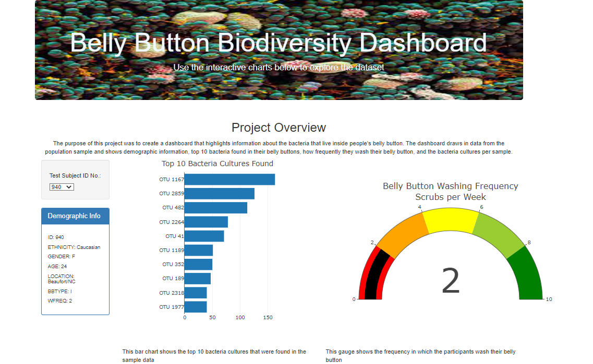
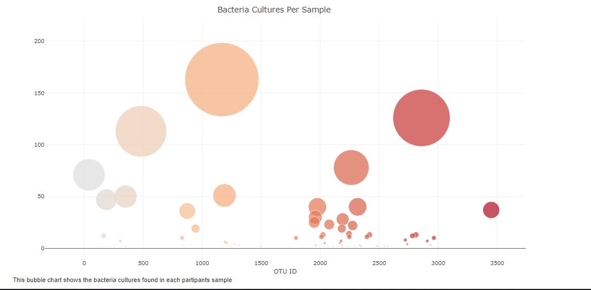

# Belly-Button-Biodiversity
## Overview 
The purpose of this project was to create a dashboard that highlights information about the bacteria that live inside people's belly button.

## Results
The dashboard draws in data from the population sample and shows demographic information, top 10 bacteria found in their belly buttons, how frequently they wash their belly button, and the bacteria cultures per sample.

